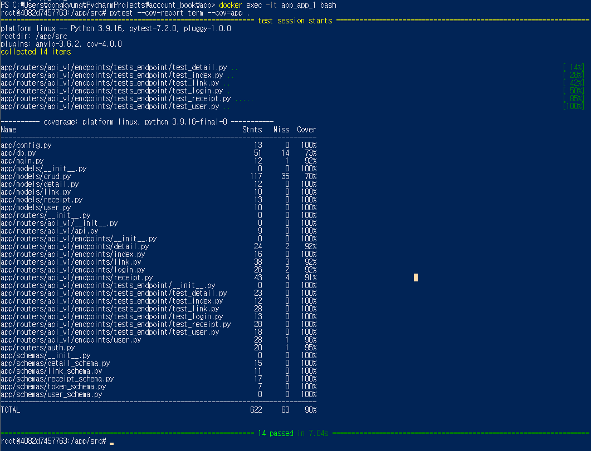
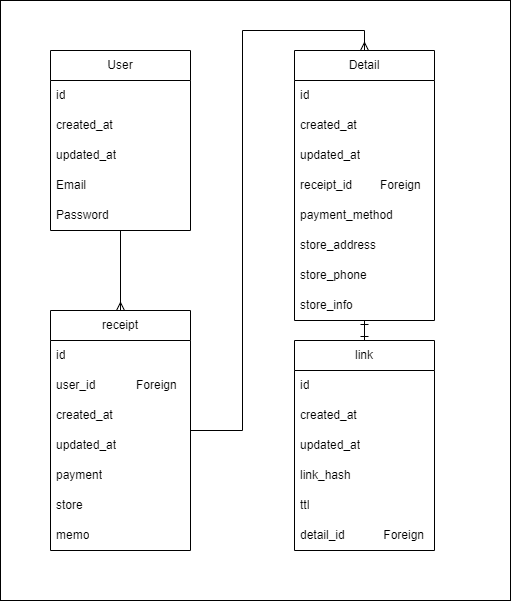

# account_book
가계부사용 및 수정을 위한 API

# requirement
```bash
docker
docker-compose
```
도커를 사용하여 `mysql`, `python`의 컨테이너로 구성하였습니다.
```bash
# python package

mysql-connector-python==8.0.31
fastapi[all]==0.88.0
sqlalchemy==1.4.44
pymysql==1.0.2
python-jose[cryptography]==3.3.0
passlib[bcrypt]==1.7.4

pytest==7.2.0
pytest-cov==4.0.0
```
# run
```bash
$ cd app
> account_book/app
$ docker-compose up -d --build
```
`docker-compose.yml`이 있는 dir로 이동하여 `up`을 실행하면 작동합니다.  
`mysql:5.7`, `python:3.9` 이미지를 다운 받고 자동으로 실행합니다.
# test
```bash
$ pwd
> account_book/app/src/app/routers/api_v1/endpoints/tests_endpoint
```
위의 경로에 API에 대한 테스트 항목이 있습니다.
코드 커버리지는 90%입니다.  


# API documents
http://localhost:8080/docs 로 이동하면 API swagger를 확인 할 수 있습니다.  

# ERD

데이터베이스는 간단하게 설계하였습니다.
한 user에 여러개의 receipt(영수증/가계부)를 가질 수 있고, 각 receipt에는 원래 하나의 detail이 있지만,  
detail은 복사가 가능하여 하나의 receipt에 여러개의 detail을 가질 수 있습니다.  
또한 각 detail은 하나의 link url을 가질 수 있습니다.  

# Tree
```bash
account_book
└─src
    └─app  <- root dir
    │   ├─models  <- DB models
    │   │  └─...
    │   ├─routers  <- APIs
    │   │  ├─api_v1  <- v1 APIs
    │   │  │  ├─endpoints  <- endpoints
    │   │  │  │  ├─tests_endpoint  <- tests
    │   │  │  │  │  └─...
    │   │  │  │  └─...
    │   │  │  └─...
    │   │  └─...
    │   ├─schemas  <- pydantic models
    │   │  └─...
    │   └─...  <- main, DB connect, config
    └─...  <- Dockerfile, compose, init-DB, requirements, wait-for-it    
```